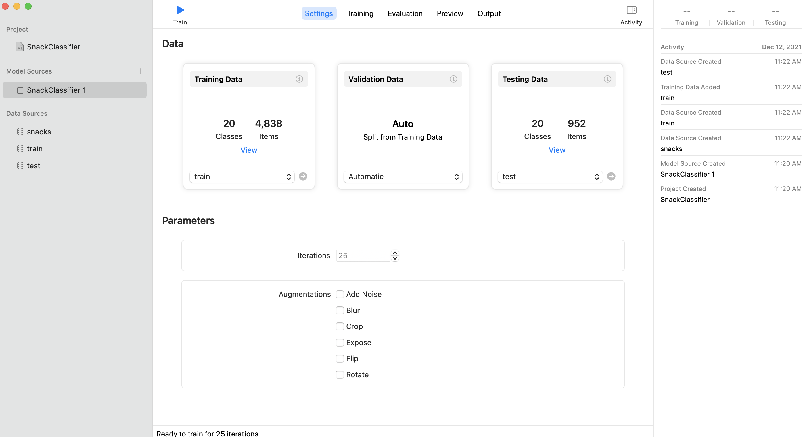
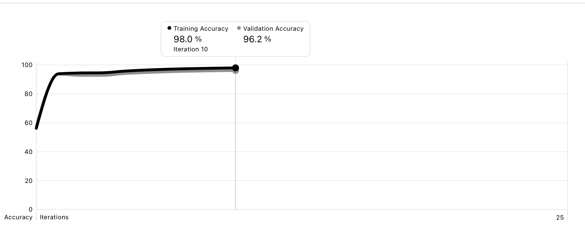
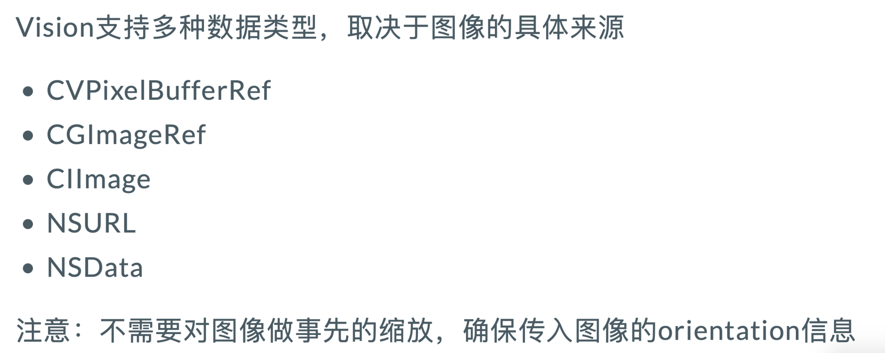

# iw04

> @StuID:191220169
>
> @Name:张洋彬 

## iOS assignment 4: Image Classification App.

### 实验任务

- 对拍照或相册里选择的图片进行分类
- 在屏幕上显示分类结果
  - 若准确度较高返回分类结果
  - 准确度较低返回"I'm not sure."


### 实验过程

​	在 `CreateML` 中，训练了 `SnackClassifier` 和 `HealthyClassifier` 两个分类模型，导入数据后如下图所示：



​	在经过训练后，两个模型的训练结果分别如下：


(snack)

(healthy)

​	将两个模型都导入项目中，创建 `request`

```swift
 lazy var classificationRequest: VNCoreMLRequest = {
        do{
            let classifier = try SnackClassifier(configuration: MLModelConfiguration())
            let model = try VNCoreMLModel(for: classifier.model)
            let request = VNCoreMLRequest(model: model, completionHandler: {
                [weak self] request,error in
                self?.processObservations(for: request, error: error)
            })
            request.imageCropAndScaleOption = .centerCrop
            return request
            
            
        } catch {
            fatalError("Failed to create request")
        }
    }()
```
​	根据传入的图片，处理这个请求，使用并发队列，提高性能

​	也根据传入图片的类型，选择了使用 `cgImage`这一类型的 `handler`



```swift
func classify(image: UIImage) {
      DispatchQueue.global(qos: .userInitiated).async {
            let handler = VNImageRequestHandler(cgImage: image.cgImage!)
            do {
                //try handler.perform([self.classificationRequest]) task1
                try handler.perform([self.healthyclassificationRequest])//task2
            } catch {
                print("Failed to perform classification: \(error)")
            }
      }
  }
```
​	分类结果的处理函数如下图所示
```swift
func processObservations(for request: VNRequest, error: Error?) {
        if let results = request.results as? [VNClassificationObservation] {
            if results.isEmpty {
                self.resultsLabel.text = "Nothing found"
            } else {
                let result = results[0].identifier
                let confidence = results[0].confidence
                DispatchQueue.main.async {
                    if confidence > 0.8{
                        self.resultsLabel.text = result + String(format: "   %.1f%%", confidence * 100)
                    }else{
                        self.resultsLabel.text = "I'm not sure."
                    }
                    self.showResultsView()
                }
                print(result)
            }
        } else if let error = error {
            self.resultsLabel.text = "Error: \(error.localizedDescription)"
        } else {
            self.resultsLabel.text = "???"
        }
    }
```

​	可见，`confidence` 超过0.8时，显示分类的类型加可信度，否则返回 `“I‘m not sure.”`


### 实验心得

​	这次实验主要是为了体会请求模型操作的过程，然后在训练模型的过程中，也根据 `healthy`和`unhealthy`根据认知创建了相应的数据集并得到了一个较为准确的模型，通过一些简单的测试，发现模型基本准确。

